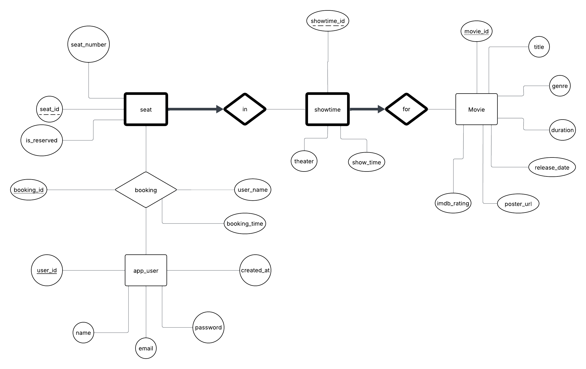

# CineTrack Project

## Overview
The CineTrack application is designed for users to be able to view both current and upcoming movies based on different categories & reserve seats for specific showtimes.

## Project Framework
The backend of the project is using python and fastapi. 
The frontend is using Next.js.

## ER Diagram
For the CineTrack app, there are four entieies and three relationships

### Entities
**Movie**
- movie_id
- title
- genre
- duration
- imdb_rating
- poster_url
- release_date

**showtime**
- theater
- show_time
- showtime_id

**seat**
- seat_number
- seat_id
- is_reserved

**app_user**
- user_id
- name
- email
- password
- created_at

### Relationships
**booking**
- booking_id
- user_name
- booking_id

**in**
- Identifying relationship for the weak entity seat

**for**
- Identifying relationship for the weak entity showtime

**ER Diagram**

## Instructions on how to start project

1. Clone the repository on your local machine.
2. Create a .env file that connects to the Supabase database.
3. Have two terminals ready to use.
4. On the first termnial, chnage your directory to the backend folder.
5. Create a python virtual environment (python3 -m venv venv).
6. Use pip3 install -r requirements.txt to download all the required python packages.
7. Start the backend by using the following command: uvicorn app.main:app --reload
8. On the other terminal, change your directory to the frontend
9. Use the following command to start the frontend: npm run dev
10. Open local host with port 3000 on a web browser to view the project.
